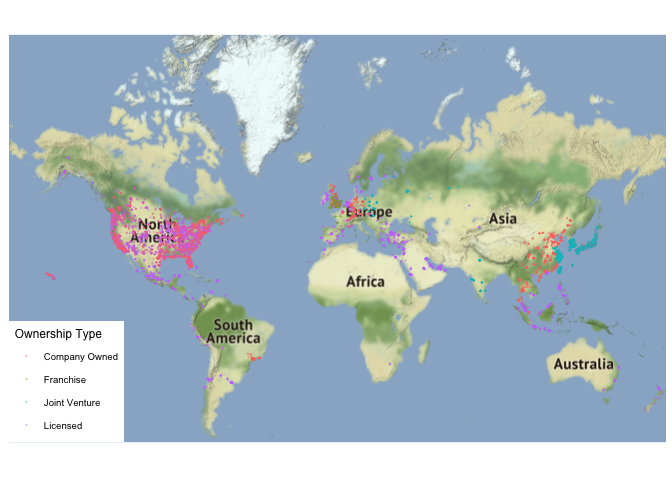
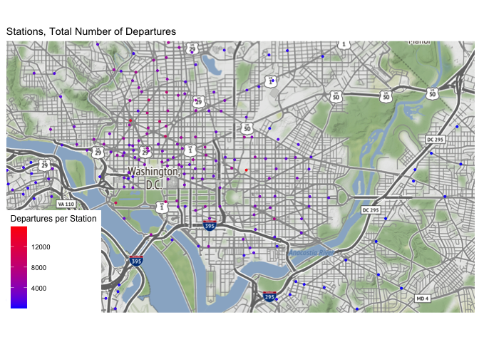

```r
library(tidyverse)     # for data cleaning and plotting
library(googlesheets4) # for reading googlesheet data
library(lubridate)     # for date manipulation
library(openintro)     # for the abbr2state() function
library(palmerpenguins)# for Palmer penguin data
library(maps)          # for map data
library(ggmap)         # for mapping points on maps
library(gplots)        # for col2hex() function
library(RColorBrewer)  # for color palettes
library(sf)            # for working with spatial data
library(leaflet)       # for highly customizable mapping
library(carData)       # for Minneapolis police stops data
library(ggthemes)      # for more themes (including theme_map())
gs4_deauth()           # To not have to authorize each time you knit.
theme_set(theme_minimal())
```


```r
# Starbucks locations
Starbucks <- read_csv("https://www.macalester.edu/~ajohns24/Data/Starbucks.csv")

starbucks_us_by_state <- Starbucks %>% 
  filter(Country == "US") %>% 
  count(`State/Province`) %>% 
  mutate(state_name = str_to_lower(abbr2state(`State/Province`))) 

# Lisa's favorite St. Paul places - example for you to create your own data
favorite_stp_by_lisa <- tibble(
  place = c("Home", "Macalester College", "Adams Spanish Immersion", 
            "Spirit Gymnastics", "Bama & Bapa", "Now Bikes",
            "Dance Spectrum", "Pizza Luce", "Brunson's"),
  long = c(-93.1405743, -93.1712321, -93.1451796, 
           -93.1650563, -93.1542883, -93.1696608, 
           -93.1393172, -93.1524256, -93.0753863),
  lat = c(44.950576, 44.9378965, 44.9237914,
          44.9654609, 44.9295072, 44.9436813, 
          44.9399922, 44.9468848, 44.9700727)
  )

#COVID-19 data from the New York Times
covid19 <- read_csv("https://raw.githubusercontent.com/nytimes/covid-19-data/master/us-states.csv")
```

## Put your homework on GitHub!

If you were not able to get set up on GitHub last week, go [here](https://github.com/llendway/github_for_collaboration/blob/master/github_for_collaboration.md) and get set up first. Then, do the following (if you get stuck on a step, don't worry, I will help! You can always get started on the homework and we can figure out the GitHub piece later):

* Create a repository on GitHub, giving it a nice name so you know it is for the 4th weekly exercise assignment (follow the instructions in the document/video).  
* Copy the repo name so you can clone it to your computer. In R Studio, go to file --> New project --> Version control --> Git and follow the instructions from the document/video.  
* Download the code from this document and save it in the repository folder/project on your computer.  
* In R Studio, you should then see the .Rmd file in the upper right corner in the Git tab (along with the .Rproj file and probably .gitignore).  
* Check all the boxes of the files in the Git tab under Stage and choose commit.  
* In the commit window, write a commit message, something like "Initial upload" would be appropriate, and commit the files.  
* Either click the green up arrow in the commit window or close the commit window and click the green up arrow in the Git tab to push your changes to GitHub.  
* Refresh your GitHub page (online) and make sure the new documents have been pushed out.  
* Back in R Studio, knit the .Rmd file. When you do that, you should have two (as long as you didn't make any changes to the .Rmd file, in which case you might have three) files show up in the Git tab - an .html file and an .md file. The .md file is something we haven't seen before and is here because I included `keep_md: TRUE` in the YAML heading. The .md file is a markdown (NOT R Markdown) file that is an interim step to creating the html file. They are displayed fairly nicely in GitHub, so we want to keep it and look at it there. Click the boxes next to these two files, commit changes (remember to include a commit message), and push them (green up arrow).  
* As you work through your homework, save and commit often, push changes occasionally (maybe after you feel finished with an exercise?), and go check to see what the .md file looks like on GitHub.  
* If you have issues, let me know! This is new to many of you and may not be intuitive at first. But, I promise, you'll get the hang of it! 


## Instructions

* Put your name at the top of the document. 

* **For ALL graphs, you should include appropriate labels.** 

* Feel free to change the default theme, which I currently have set to `theme_minimal()`. 

* Use good coding practice. Read the short sections on good code with [pipes](https://style.tidyverse.org/pipes.html) and [ggplot2](https://style.tidyverse.org/ggplot2.html). **This is part of your grade!**

* When you are finished with ALL the exercises, uncomment the options at the top so your document looks nicer. Don't do it before then, or else you might miss some important warnings and messages.


## Warm-up exercises from tutorial

These exercises will reiterate what you learned in the "Mapping data with R" tutorial. If you haven't gone through the tutorial yet, you should do that first.

### Starbucks locations (`ggmap`)

  1. Add the `Starbucks` locations to a world map. Add an aesthetic to the world map that sets the color of the points according to the ownership type. What, if anything, can you deduce from this visualization?  

```r
world <- get_stamenmap(
    bbox = c(left = -180, bottom = -57, right = 179, top = 82.1), 
    maptype = "terrain",
    zoom = 2)

ggmap(world) +
  geom_point(data = Starbucks, 
             aes(x = Longitude, y = Latitude, color = `Ownership Type`), 
             alpha = .3, 
             size = .1) +
  theme_map()
```

<!-- -->

**Most Starbucks in North America, Western Europe,South America, and Southeast Asia are licensed or company owned. Most Starbucks in East Asia are joint ventures, as are a few in Eastern Europe. There are few Starbucks in Africa and Australia.**

  2. Construct a new map of Starbucks locations in the Twin Cities metro area (approximately the 5 county metro area).  

```r
test <- get_stamenmap(
    bbox = c(left = -93.5262, bottom = 44.8527, right = -92.8876, top = 45.1150), 
    maptype = "terrain",
    zoom = 11)

ggmap(test) +
  geom_point(data = Starbucks, 
             aes(x = Longitude, y = Latitude, color = `Ownership Type`), 
             alpha = .9, 
             size = .7) +
  theme_map()
```

<!-- -->

  3. In the Twin Cities plot, play with the zoom number. What does it do?  (just describe what it does - don't actually include more than one map).  
**The zoom number changes the level of detail shown in the map, while showing the same area.A smaller number shows less detail whereas a larger number shows more detail--more streets, labels, etc.**

  4. Try a couple different map types (see `get_stamenmap()` in help and look at `maptype`). Include a map with one of the other map types.  

```r
toner <- get_stamenmap(
    bbox = c(left = -93.5262, bottom = 44.8527, right = -92.8876, top = 45.1150), 
    maptype = "toner",
    zoom = 11)

ggmap(toner) +
  geom_point(data = Starbucks, 
             aes(x = Longitude, y = Latitude, color = `Ownership Type`), 
             alpha = .9, 
             size = .7) +
  theme_map()
```

<!-- -->

```r
watercolor <- get_stamenmap(
    bbox = c(left = -93.5262, bottom = 44.8527, right = -92.8876, top = 45.1150), 
    maptype = "watercolor",
    zoom = 11)

ggmap(watercolor) +
  geom_point(data = Starbucks, 
             aes(x = Longitude, y = Latitude, color = `Ownership Type`), 
             alpha = .9, 
             size = .7) +
  theme_map()
```

<!-- -->

```r
tonerhybrid <- get_stamenmap(
    bbox = c(left = -93.5262, bottom = 44.8527, right = -92.8876, top = 45.1150), 
    maptype = "toner-hybrid",
    zoom = 11)

ggmap(tonerhybrid) +
  geom_point(data = Starbucks, 
             aes(x = Longitude, y = Latitude, color = `Ownership Type`), 
             alpha = .9, 
             size = .7) +
  theme_map()
```

<!-- -->

  5. Add a point to the map that indicates Macalester College and label it appropriately. There are many ways you can do think, but I think it's easiest with the `annotate()` function (see `ggplot2` cheatsheet).

```r
macmap <- get_stamenmap(
    bbox = c(left = -93.5262, bottom = 44.8527, right = -92.8876, top = 45.1150), 
    maptype = "terrain",
    zoom = 11)

ggmap(macmap) +
  geom_point(data = Starbucks, 
            aes(x = Longitude, y = Latitude, color = `Ownership Type`), 
             alpha = .9, 
             size = .7)+
  theme_map()+
  annotate("text", x = -93.1691, y = 44.9379, label = "Macalester 
  College", size = 2.2)
```

<!-- -->

### Choropleth maps with Starbucks data (`geom_map()`)

The example I showed in the tutorial did not account for population of each state in the map. In the code below, a new variable is created, `starbucks_per_10000`, that gives the number of Starbucks per 10,000 people. It is in the `starbucks_with_2018_pop_est` dataset.


```r
census_pop_est_2018 <- read_csv("https://www.dropbox.com/s/6txwv3b4ng7pepe/us_census_2018_state_pop_est.csv?dl=1") %>% 
  separate(state, into = c("dot","state"), extra = "merge") %>% 
  select(-dot) %>% 
  mutate(state = str_to_lower(state))

starbucks_with_2018_pop_est <-
  starbucks_us_by_state %>% 
  left_join(census_pop_est_2018,
            by = c("state_name" = "state")) %>% 
  mutate(starbucks_per_10000 = (n/est_pop_2018)*10000)
```

  6. **`dplyr` review**: Look through the code above and describe what each line of code does.


```r
census_pop_est_2018 <- read_csv("https://www.dropbox.com/s/6txwv3b4ng7pepe/us_census_2018_state_pop_est.csv?dl=1") %>%  #reads in the data
  separate(state, into = c("dot","state"), extra = "merge") %>% # separates out the extra information in the state column so that the period is not attached to the name. first cleaning step
  select(-dot) %>% # removes the dot column entirely
  mutate(state = str_to_lower(state)) # makes lowercase

starbucks_with_2018_pop_est <- # names new table/df
  starbucks_us_by_state %>% # indicates first dataset to be joined, the starbucks' by state
  left_join(census_pop_est_2018, # joins the census pop data we just cleaned a bit to the starbucks data
            by = c("state_name" = "state")) %>% # joins by states as common unique indicator
  mutate(starbucks_per_10000 = (n/est_pop_2018)*10000) # creates new column that has starbucks per 10000 people in the new dataset we have
```


  7. Create a choropleth map that shows the number of Starbucks per 10,000 people on a map of the US. Use a new fill color, add points for all Starbucks in the US (except Hawaii and Alaska), add an informative title for the plot, and include a caption that says who created the plot (you!). Make a conclusion about what you observe.


```r
states_map <- map_data("state")
starbucks_with_2018_pop_est %>% 
  ggplot() +
  geom_map(map = states_map,
           aes(map_id = state_name,
               fill = starbucks_per_10000)) +
  expand_limits(x = states_map$long, y = states_map$lat) + 
  labs(title = "Starbucks per 10,000 people", 
       caption = "Created by Amy Plambeck :)") +
  theme_map() +
  theme(legend.background = element_blank())
```

<!-- -->

**There are the most Starbucks per 10,000 on the West Coast (and Colorado) compared to the rest of the United States. (Unsurprisingly, a lot in Washington.)**


### A few of your favorite things (`leaflet`)

  8. In this exercise, you are going to create a single map of some of your favorite places! The end result will be one map that satisfies the criteria below. 

  * Create a data set using the `tibble()` function that has 10-15 rows of your favorite places. The columns will be the name of the location, the latitude, the longitude, and a column that indicates if it is in your top 3 favorite locations or not. For an example of how to use `tibble()`, look at the `favorite_stp_by_lisa` I created in the data R code chunk at the beginning.  

  * Create a `leaflet` map that uses circles to indicate your favorite places. Label them with the name of the place. Choose the base map you like best. Color your 3 favorite places differently than the ones that are not in your top 3 (HINT: `colorFactor()`). Add a legend that explains what the colors mean.  
  
  * Connect all your locations together with a line in a meaningful way (you may need to order them differently in the original data).  
  
  * If there are other variables you want to add that could enhance your plot, do that now.  
  

```r
amy_fav <- tibble(
  place = c("MiA","Kim's", "Mickey's","Fairview Park", "STP Farmer's Market", "Mother Earth Gardens","The Monument","Fine Line", "Midtown Global Market", "Hard Times Cafe"), 
                  longitude = c(-93.274,-93.167,-93.098,-93.285,-93.085,-93.213,-93.196, -93.271,-93.259,-93.246), 
                  latitude = c(44.959,44.961,44.947,45.008,44.949,44.934,44.941,44.981,44.948,44.969), 
                  top3 = c("yes","yes","yes","no","no","no","no","no","no","no")
                  )
```


```r
library(htmltools)

palette <- colorFactor(palette = colorRamp(c("#9d399e","#ff6200"), interpolate = "spline"), domain = amy_fav$top3)


leaflet(data = amy_fav) %>% 
  addProviderTiles(providers$Stamen.Terrain) %>% 
  addLabelOnlyMarkers(~longitude, ~latitude) %>% 
  addCircles(lng = ~longitude, 
             lat = ~latitude, 
             label = ~place, 
             weight = 5, 
             opacity = 1, 
             color = ~palette(top3)) %>% 
  addLegend("bottomright", pal = palette, values = ~amy_fav$top3, title = "Top 3 Favorite place?", opacity = 1
    )%>% 
  addPolylines(lng = ~longitude, 
               lat = ~latitude, 
               color = col2hex("lightgreen"))
```

<!--html_preserve--><div id="htmlwidget-09a0987e62b6f5a351be" style="width:672px;height:480px;" class="leaflet html-widget"></div>
<script type="application/json" data-for="htmlwidget-09a0987e62b6f5a351be">{"x":{"options":{"crs":{"crsClass":"L.CRS.EPSG3857","code":null,"proj4def":null,"projectedBounds":null,"options":{}}},"calls":[{"method":"addProviderTiles","args":["Stamen.Terrain",null,null,{"errorTileUrl":"","noWrap":false,"detectRetina":false}]},{"method":"addMarkers","args":[[44.959,44.961,44.947,45.008,44.949,44.934,44.941,44.981,44.948,44.969],[-93.274,-93.167,-93.098,-93.285,-93.085,-93.213,-93.196,-93.271,-93.259,-93.246],{"iconUrl":{"data":"data:image/png;base64,iVBORw0KGgoAAAANSUhEUgAAAAEAAAABCAQAAAC1HAwCAAAAC0lEQVR4nGP6zwAAAgcBApocMXEAAAAASUVORK5CYII=","index":0},"iconWidth":1,"iconHeight":1},null,null,{"interactive":true,"draggable":false,"keyboard":true,"title":"","alt":"","zIndexOffset":0,"opacity":1,"riseOnHover":false,"riseOffset":250},null,null,null,null,null,{"interactive":false,"permanent":false,"direction":"auto","opacity":1,"offset":[0,0],"textsize":"10px","textOnly":false,"className":"","sticky":true},null]},{"method":"addCircles","args":[[44.959,44.961,44.947,45.008,44.949,44.934,44.941,44.981,44.948,44.969],[-93.274,-93.167,-93.098,-93.285,-93.085,-93.213,-93.196,-93.271,-93.259,-93.246],10,null,null,{"interactive":true,"className":"","stroke":true,"color":["#FF6200","#FF6200","#FF6200","#9D399E","#9D399E","#9D399E","#9D399E","#9D399E","#9D399E","#9D399E"],"weight":5,"opacity":1,"fill":true,"fillColor":["#FF6200","#FF6200","#FF6200","#9D399E","#9D399E","#9D399E","#9D399E","#9D399E","#9D399E","#9D399E"],"fillOpacity":0.2},null,null,["MiA","Kim's","Mickey's","Fairview Park","STP Farmer's Market","Mother Earth Gardens","The Monument","Fine Line","Midtown Global Market","Hard Times Cafe"],{"interactive":false,"permanent":false,"direction":"auto","opacity":1,"offset":[0,0],"textsize":"10px","textOnly":false,"className":"","sticky":true},null,null]},{"method":"addLegend","args":[{"colors":["#9D399E","#FF6200"],"labels":["no","yes"],"na_color":null,"na_label":"NA","opacity":1,"position":"bottomright","type":"factor","title":"Top 3 Favorite place?","extra":null,"layerId":null,"className":"info legend","group":null}]},{"method":"addPolylines","args":[[[[{"lng":[-93.274,-93.167,-93.098,-93.285,-93.085,-93.213,-93.196,-93.271,-93.259,-93.246],"lat":[44.959,44.961,44.947,45.008,44.949,44.934,44.941,44.981,44.948,44.969]}]]],null,null,{"interactive":true,"className":"","stroke":true,"color":"#90EE90","weight":5,"opacity":0.5,"fill":false,"fillColor":"#90EE90","fillOpacity":0.2,"smoothFactor":1,"noClip":false},null,null,null,{"interactive":false,"permanent":false,"direction":"auto","opacity":1,"offset":[0,0],"textsize":"10px","textOnly":false,"className":"","sticky":true},null]}],"limits":{"lat":[44.934,45.008],"lng":[-93.285,-93.085]}},"evals":[],"jsHooks":[]}</script><!--/html_preserve-->

**Hover for labels. The lines go in order of my favorite places, although it's more of a tie after the top 3.**


## Revisiting old datasets

This section will revisit some datasets we have used previously and bring in a mapping component. 

### Bicycle-Use Patterns

The data come from Washington, DC and cover the last quarter of 2014.

Two data tables are available:

- `Trips` contains records of individual rentals
- `Stations` gives the locations of the bike rental stations

Here is the code to read in the data. We do this a little differently than usualy, which is why it is included here rather than at the top of this file. To avoid repeatedly re-reading the files, start the data import chunk with `{r cache = TRUE}` rather than the usual `{r}`. This code reads in the large dataset right away.


```r
data_site <- 
  "https://www.macalester.edu/~dshuman1/data/112/2014-Q4-Trips-History-Data.rds" 
Trips <- readRDS(gzcon(url(data_site)))
Stations<-read_csv("http://www.macalester.edu/~dshuman1/data/112/DC-Stations.csv")
```

  9. Use the latitude and longitude variables in `Stations` to make a visualization of the total number of departures from each station in the `Trips` data. Use either color or size to show the variation in number of departures. This time, plot the points on top of a map. Use any of the mapping tools you'd like.
  

```r
departures_station<- count(Trips, vars = sstation)

Stations <-
  Stations %>% 
  right_join(departures_station,
            by = c("name" = "vars"))
```


```r
pal <- colorNumeric(
  palette = "RdYlBu",
  domain = Stations$n)


leaflet(data = Stations) %>% 
  addProviderTiles(providers$Stamen.Terrain) %>% 
  addLabelOnlyMarkers(~long, ~lat) %>% 
  addCircles(lng = ~long, 
             lat = ~lat, 
             label = ~name, 
             weight = 5, 
             opacity = 1,
             color = ~pal(n)) %>% 
 addLegend("bottomright", pal =pal, values = ~n, title = "Stations, Total Number of Departures", opacity = 1)
```

<!--html_preserve--><div id="htmlwidget-e562226265a16f218a34" style="width:672px;height:480px;" class="leaflet html-widget"></div>
<script type="application/json" data-for="htmlwidget-e562226265a16f218a34">{"x":{"options":{"crs":{"crsClass":"L.CRS.EPSG3857","code":null,"proj4def":null,"projectedBounds":null,"options":{}}},"calls":[{"method":"addProviderTiles","args":["Stamen.Terrain",null,null,{"errorTileUrl":"","noWrap":false,"detectRetina":false}]},{"method":"addMarkers","args":[[38.8561,38.85725,38.8564,38.86017,38.857866,38.862303,38.8637,38.8573,38.8629,38.848441,38.8426,38.8533,38.850688,38.9003,38.9176,38.929464,38.926088,38.922925,38.9268,38.923203,38.9319,38.8767,38.90985,38.912682,38.9086,38.8963,38.9008,38.936043,38.9375,38.9346,38.90304,38.8896,38.9308,38.8601,38.934267,38.878,38.897063,38.901385,38.862669,38.867373,38.8952,38.919077,38.9172,38.9249,38.8743,38.9154,38.9155,38.8763,38.9101,38.9057,38.90534,38.90276,38.899408,38.8851,38.8803,38.884,38.9121,38.944551,38.9126,38.8792,38.938736,38.934751,38.947774,38.865784,38.873057,38.886952,38.899632,38.894,38.887237,38.9022212,38.933668,38.894919,38.886266,38.893028,38.895184,38.884,38.904742,38.947607,38.9003,38.897222,38.8991,38.90572,38.927872,38.903407,38.90375,38.87675,38.894758,38.916442,38.900283,38.8997,38.932514,38.910972,38.899972,38.900412,38.900413,38.889955,38.8692,38.894832,38.91554,38.898364,38.894514,38.897324,38.902061,38.908905,38.895344,38.8923,38.90774,38.899983,38.903827,38.89696,38.897446,38.905607,38.922581,38.898069,38.844015,38.88412,38.897857,38.897315,38.8946,38.893648,38.891696,38.892164,38.86559,38.892459,38.889,38.920669,38.906602,38.9059,38.8904,38.8881,38.88786,38.89968,38.887299,38.88412,38.881185,38.912719,38.9418,38.915417,38.928156,38.917761,38.889935,38.930282,38.905126,38.88732,38.844711,38.876393,38.8815,38.896923,38.90268,38.885801,38.896015,38.87861,38.922649,38.928743,38.882788,38.88397,38.884734,38.888553,38.888767,38.87887,38.894573,38.893241,38.89593,38.89054,38.880834,38.881044,38.882629,38.879819,38.866611,38.883921,38.880151,38.884616,38.90509,38.903584,38.903819,38.901539,38.902204,38.803124,38.804718,38.810743,38.805317,38.902,38.805648,38.811456,38.814577,38.805767,38.9066,38.895914,38.90088,38.884961,38.889365,38.888251,38.894722,38.90093,38.943837,38.954812,38.905707,38.863833,38.857803,38.846222,38.918809,38.956595,38.949662,38.942016,38.956432,38.847977,38.8444,38.860789,38.835213,38.84232,38.848454,38.987,38.90849,38.854691,38.955016,38.908142,38.92333,38.889988,38.912659,38.889908,38.897274,38.927095,38.897195,38.928644,38.884085,38.843222,38.863897,38.903732,38.916787,38.852248,38.834108,38.880705,38.867262,38.887378,38.894851,38.917622,38.918155,38.892275,38.88731,38.887312,38.927497,38.862478,38.856319,38.871822,38.981103,39.096312,39.093783,38.988562,39.084125,38.98954,39.094772,38.98128,38.983627,38.99521,38.983525,38.961763,38.921074,38.87501,38.920387,38.876737,39.120045,39.099376,39.083705,39.123513,38.990249,39.107709,38.982456,39.000578,39.095661,38.989724,38.975,38.977933,38.992375,38.990639,38.977093,39.102099,39.094103,39.076331,39.102212,38.992679,38.999388,39.114688,39.110314,38.923583,38.90706,38.898536,38.908473,38.878433,38.873755,38.86646,38.999634,38.96115,38.899703,38.837666,38.869418,38.941154,39.103091,39.097636,39.085394,38.900358,38.952369,38.975219,38.920682,38.866471,38.839912,39.119765,38.964992,39.084379,38.984691,38.88992,38.903582,38.804378,38.894941,38.869442,38.898404,38.897612,38.901755,38.801111,38.82175,38.802677,38.820064,38.82595,38.820932,38.833077,38.986743,38.864702,38.96497,38.90381,38.89841,38.997653,38.912648,38.859254,38.908008,38.895929,38.898984,null,null,null,null,null,null,null,null,null,null,null,null],[-77.0512,-77.05332,-77.0492,-77.049593,-77.05949,-77.059936,-77.0633,-77.0511,-77.0528,-77.051516,-77.0502,-77.0498,-77.05152,-77.0429,-77.0321,-77.027822,-77.036536,-77.042581,-77.0322,-77.047637,-77.0388,-77.0178,-77.034438,-77.031681,-77.0323,-77.045,-77.047,-77.024649,-77.0328,-76.9955,-77.019027,-76.9769,-77.0315,-76.9672,-77.057979,-76.9607,-76.947446,-76.941877,-76.994637,-76.988039,-77.0436,-77.000648,-77.0259,-77.0222,-77.0057,-77.0446,-77.0222,-77.0037,-77.0444,-77.0056,-77.046774,-77.03863,-77.015289,-77.0023,-76.9862,-76.9861,-77.0387,-77.063896,-77.0135,-76.9953,-77.087171,-77.074647,-77.032818,-76.9784,-76.971015,-76.996806,-77.031686,-76.947974,-77.028226,-77.059219,-76.991016,-77.046587,-77.022241,-77.026013,-77.054845,-76.995397,-77.041606,-77.079382,-76.9882,-77.019347,-77.0337,-77.022264,-77.043358,-77.043648,-77.06269,-77.02127,-76.997114,-77.0682,-77.029822,-77.023086,-76.992889,-77.00495,-76.998347,-77.001949,-76.982872,-77.000349,-76.9599,-76.987633,-77.03818,-77.027869,-77.031617,-77.022322,-77.038322,-77.04478,-77.016106,-77.0436,-77.071652,-76.991383,-77.053485,-77.00493,-77.009888,-77.027137,-77.070334,-77.031823,-77.050537,-77.04657,-77.026975,-77.070993,-77.072305,-77.076701,-77.0846,-77.079375,-76.952103,-77.046567,-77.0925,-77.04368,-77.038785,-77.0325,-77.0889,-77.09308,-77.094875,-77.041539,-77.018939,-77.017445,-77.001828,-77.022155,-77.0251,-77.012289,-77.02344,-77.04062,-76.93723,-77.055599,-77.056887,-76.983569,-76.987823,-77.107735,-77.10396,-77.086502,-77.02674,-77.097745,-77.078107,-77.006004,-77.077271,-77.012457,-77.103148,-77.10783,-77.093485,-77.032429,-77.02858,-77.1207,-77.01994,-77.086045,-77.089006,-77.08095,-77.091129,-77.111768,-77.109366,-77.037413,-76.985238,-77.116817,-77.107673,-77.10108,-76.9941,-77.044789,-77.0284,-77.046564,-77.04337,-77.040363,-77.043363,-77.044664,-77.049883,-77.03353,-77.05293,-77.050276,-77.052808,-77.06072,-77.05152,-77.026064,-77.048911,-77.08777,-77.077294,-77.049426,-77.045128,-77.018677,-77.077078,-77.082426,-77.003041,-77.080319,-77.086733,-77.069275,-77.041571,-77.019815,-77.027333,-77.032652,-77.032947,-77.075104,-77.085931,-77.09586,-77.094295,-77.089555,-77.084918,-77.029417,-77.063586,-77.100555,-77.069956,-77.038359,-77.0352,-76.995193,-77.017669,-76.983326,-76.994749,-76.978924,-76.983575,-76.990955,-76.957461,-76.999388,-76.990037,-76.987211,-77.028139,-77.105022,-77.087323,-77.08596,-77.072315,-77.001955,-77.02324,-77.01597,-77.004746,-77.013917,-77.01397,-77.025762,-76.997194,-77.086599,-77.11153,-77.107906,-77.097426,-77.192672,-77.202501,-77.096539,-77.151291,-77.098029,-77.145213,-77.011336,-77.006311,-77.02918,-77.095367,-77.085998,-77.031887,-77.0024,-77.025672,-76.994468,-77.156985,-77.188014,-77.149443,-77.15741,-77.02935,-77.152072,-77.091991,-77.00149,-77.159048,-77.023854,-77.01121,-77.006472,-77.100104,-77.100239,-77.094589,-77.200322,-77.132954,-77.141378,-77.177091,-77.029457,-77.031555,-77.171487,-77.182669,-77.050046,-77.015231,-76.931862,-76.933099,-77.03023,-77.089233,-77.04826,-77.109647,-77.088659,-77.008911,-77.09482,-77.095596,-77.062036,-77.196442,-77.196636,-77.145803,-77.012108,-77.002721,-77.016855,-76.995876,-77.076131,-77.087083,-77.166093,-77.103381,-77.146866,-77.094537,-77.071301,-77.067786,-77.060866,-77.09169,-77.104503,-77.024281,-77.080851,-77.051084,-77.068952,-77.047494,-77.063562,-77.057619,-77.058541,-77.053096,-77.059821,-77.000035,-77.048672,-77.075946,-77.034931,-77.039624,-77.034499,-77.041834,-77.063275,-76.996985,-77.105246,-77.078317,null,null,null,null,null,null,null,null,null,null,null,null],{"iconUrl":{"data":"data:image/png;base64,iVBORw0KGgoAAAANSUhEUgAAAAEAAAABCAQAAAC1HAwCAAAAC0lEQVR4nGP6zwAAAgcBApocMXEAAAAASUVORK5CYII=","index":0},"iconWidth":1,"iconHeight":1},null,null,{"interactive":true,"draggable":false,"keyboard":true,"title":"","alt":"","zIndexOffset":0,"opacity":1,"riseOnHover":false,"riseOffset":250},null,null,null,null,null,{"interactive":false,"permanent":false,"direction":"auto","opacity":1,"offset":[0,0],"textsize":"10px","textOnly":false,"className":"","sticky":true},null]},{"method":"addCircles","args":[[38.8561,38.85725,38.8564,38.86017,38.857866,38.862303,38.8637,38.8573,38.8629,38.848441,38.8426,38.8533,38.850688,38.9003,38.9176,38.929464,38.926088,38.922925,38.9268,38.923203,38.9319,38.8767,38.90985,38.912682,38.9086,38.8963,38.9008,38.936043,38.9375,38.9346,38.90304,38.8896,38.9308,38.8601,38.934267,38.878,38.897063,38.901385,38.862669,38.867373,38.8952,38.919077,38.9172,38.9249,38.8743,38.9154,38.9155,38.8763,38.9101,38.9057,38.90534,38.90276,38.899408,38.8851,38.8803,38.884,38.9121,38.944551,38.9126,38.8792,38.938736,38.934751,38.947774,38.865784,38.873057,38.886952,38.899632,38.894,38.887237,38.9022212,38.933668,38.894919,38.886266,38.893028,38.895184,38.884,38.904742,38.947607,38.9003,38.897222,38.8991,38.90572,38.927872,38.903407,38.90375,38.87675,38.894758,38.916442,38.900283,38.8997,38.932514,38.910972,38.899972,38.900412,38.900413,38.889955,38.8692,38.894832,38.91554,38.898364,38.894514,38.897324,38.902061,38.908905,38.895344,38.8923,38.90774,38.899983,38.903827,38.89696,38.897446,38.905607,38.922581,38.898069,38.844015,38.88412,38.897857,38.897315,38.8946,38.893648,38.891696,38.892164,38.86559,38.892459,38.889,38.920669,38.906602,38.9059,38.8904,38.8881,38.88786,38.89968,38.887299,38.88412,38.881185,38.912719,38.9418,38.915417,38.928156,38.917761,38.889935,38.930282,38.905126,38.88732,38.844711,38.876393,38.8815,38.896923,38.90268,38.885801,38.896015,38.87861,38.922649,38.928743,38.882788,38.88397,38.884734,38.888553,38.888767,38.87887,38.894573,38.893241,38.89593,38.89054,38.880834,38.881044,38.882629,38.879819,38.866611,38.883921,38.880151,38.884616,38.90509,38.903584,38.903819,38.901539,38.902204,38.803124,38.804718,38.810743,38.805317,38.902,38.805648,38.811456,38.814577,38.805767,38.9066,38.895914,38.90088,38.884961,38.889365,38.888251,38.894722,38.90093,38.943837,38.954812,38.905707,38.863833,38.857803,38.846222,38.918809,38.956595,38.949662,38.942016,38.956432,38.847977,38.8444,38.860789,38.835213,38.84232,38.848454,38.987,38.90849,38.854691,38.955016,38.908142,38.92333,38.889988,38.912659,38.889908,38.897274,38.927095,38.897195,38.928644,38.884085,38.843222,38.863897,38.903732,38.916787,38.852248,38.834108,38.880705,38.867262,38.887378,38.894851,38.917622,38.918155,38.892275,38.88731,38.887312,38.927497,38.862478,38.856319,38.871822,38.981103,39.096312,39.093783,38.988562,39.084125,38.98954,39.094772,38.98128,38.983627,38.99521,38.983525,38.961763,38.921074,38.87501,38.920387,38.876737,39.120045,39.099376,39.083705,39.123513,38.990249,39.107709,38.982456,39.000578,39.095661,38.989724,38.975,38.977933,38.992375,38.990639,38.977093,39.102099,39.094103,39.076331,39.102212,38.992679,38.999388,39.114688,39.110314,38.923583,38.90706,38.898536,38.908473,38.878433,38.873755,38.86646,38.999634,38.96115,38.899703,38.837666,38.869418,38.941154,39.103091,39.097636,39.085394,38.900358,38.952369,38.975219,38.920682,38.866471,38.839912,39.119765,38.964992,39.084379,38.984691,38.88992,38.903582,38.804378,38.894941,38.869442,38.898404,38.897612,38.901755,38.801111,38.82175,38.802677,38.820064,38.82595,38.820932,38.833077,38.986743,38.864702,38.96497,38.90381,38.89841,38.997653,38.912648,38.859254,38.908008,38.895929,38.898984,null,null,null,null,null,null,null,null,null,null,null,null],[-77.0512,-77.05332,-77.0492,-77.049593,-77.05949,-77.059936,-77.0633,-77.0511,-77.0528,-77.051516,-77.0502,-77.0498,-77.05152,-77.0429,-77.0321,-77.027822,-77.036536,-77.042581,-77.0322,-77.047637,-77.0388,-77.0178,-77.034438,-77.031681,-77.0323,-77.045,-77.047,-77.024649,-77.0328,-76.9955,-77.019027,-76.9769,-77.0315,-76.9672,-77.057979,-76.9607,-76.947446,-76.941877,-76.994637,-76.988039,-77.0436,-77.000648,-77.0259,-77.0222,-77.0057,-77.0446,-77.0222,-77.0037,-77.0444,-77.0056,-77.046774,-77.03863,-77.015289,-77.0023,-76.9862,-76.9861,-77.0387,-77.063896,-77.0135,-76.9953,-77.087171,-77.074647,-77.032818,-76.9784,-76.971015,-76.996806,-77.031686,-76.947974,-77.028226,-77.059219,-76.991016,-77.046587,-77.022241,-77.026013,-77.054845,-76.995397,-77.041606,-77.079382,-76.9882,-77.019347,-77.0337,-77.022264,-77.043358,-77.043648,-77.06269,-77.02127,-76.997114,-77.0682,-77.029822,-77.023086,-76.992889,-77.00495,-76.998347,-77.001949,-76.982872,-77.000349,-76.9599,-76.987633,-77.03818,-77.027869,-77.031617,-77.022322,-77.038322,-77.04478,-77.016106,-77.0436,-77.071652,-76.991383,-77.053485,-77.00493,-77.009888,-77.027137,-77.070334,-77.031823,-77.050537,-77.04657,-77.026975,-77.070993,-77.072305,-77.076701,-77.0846,-77.079375,-76.952103,-77.046567,-77.0925,-77.04368,-77.038785,-77.0325,-77.0889,-77.09308,-77.094875,-77.041539,-77.018939,-77.017445,-77.001828,-77.022155,-77.0251,-77.012289,-77.02344,-77.04062,-76.93723,-77.055599,-77.056887,-76.983569,-76.987823,-77.107735,-77.10396,-77.086502,-77.02674,-77.097745,-77.078107,-77.006004,-77.077271,-77.012457,-77.103148,-77.10783,-77.093485,-77.032429,-77.02858,-77.1207,-77.01994,-77.086045,-77.089006,-77.08095,-77.091129,-77.111768,-77.109366,-77.037413,-76.985238,-77.116817,-77.107673,-77.10108,-76.9941,-77.044789,-77.0284,-77.046564,-77.04337,-77.040363,-77.043363,-77.044664,-77.049883,-77.03353,-77.05293,-77.050276,-77.052808,-77.06072,-77.05152,-77.026064,-77.048911,-77.08777,-77.077294,-77.049426,-77.045128,-77.018677,-77.077078,-77.082426,-77.003041,-77.080319,-77.086733,-77.069275,-77.041571,-77.019815,-77.027333,-77.032652,-77.032947,-77.075104,-77.085931,-77.09586,-77.094295,-77.089555,-77.084918,-77.029417,-77.063586,-77.100555,-77.069956,-77.038359,-77.0352,-76.995193,-77.017669,-76.983326,-76.994749,-76.978924,-76.983575,-76.990955,-76.957461,-76.999388,-76.990037,-76.987211,-77.028139,-77.105022,-77.087323,-77.08596,-77.072315,-77.001955,-77.02324,-77.01597,-77.004746,-77.013917,-77.01397,-77.025762,-76.997194,-77.086599,-77.11153,-77.107906,-77.097426,-77.192672,-77.202501,-77.096539,-77.151291,-77.098029,-77.145213,-77.011336,-77.006311,-77.02918,-77.095367,-77.085998,-77.031887,-77.0024,-77.025672,-76.994468,-77.156985,-77.188014,-77.149443,-77.15741,-77.02935,-77.152072,-77.091991,-77.00149,-77.159048,-77.023854,-77.01121,-77.006472,-77.100104,-77.100239,-77.094589,-77.200322,-77.132954,-77.141378,-77.177091,-77.029457,-77.031555,-77.171487,-77.182669,-77.050046,-77.015231,-76.931862,-76.933099,-77.03023,-77.089233,-77.04826,-77.109647,-77.088659,-77.008911,-77.09482,-77.095596,-77.062036,-77.196442,-77.196636,-77.145803,-77.012108,-77.002721,-77.016855,-76.995876,-77.076131,-77.087083,-77.166093,-77.103381,-77.146866,-77.094537,-77.071301,-77.067786,-77.060866,-77.09169,-77.104503,-77.024281,-77.080851,-77.051084,-77.068952,-77.047494,-77.063562,-77.057619,-77.058541,-77.053096,-77.059821,-77.000035,-77.048672,-77.075946,-77.034931,-77.039624,-77.034499,-77.041834,-77.063275,-76.996985,-77.105246,-77.078317,null,null,null,null,null,null,null,null,null,null,null,null],10,null,null,{"interactive":true,"className":"","stroke":true,"color":["#AF0E26","#B11127","#BC1B27","#BA1927","#B71627","#CF2A27","#BF1E27","#E75436","#B91927","#CB2827","#BA1927","#C32127","#AF0E26","#E85737","#F6FBD1","#FCA85E","#FEC476","#FEE091","#FEC071","#D62F27","#FCA45C","#FA9153","#E9F6EA","#FED383","#FFCA7B","#EF623D","#F77D4A","#F57546","#E55134","#B61627","#FFCD7E","#D42E27","#FED787","#A70326","#DB392A","#A50026","#A80426","#A60126","#B21127","#AD0B26","#CA2627","#C62427","#F57345","#CE2A27","#B71627","#FED788","#FDB265","#D73127","#6AA0CB","#FFCD7E","#FEBF71","#FEBC6E","#E75336","#F57245","#E14730","#E34B32","#FFFFBE","#D02B27","#F7824C","#CD2927","#CE2A27","#CB2727","#B71627","#A80426","#AA0626","#F77F4A","#EE613D","#A80426","#F46C43","#EC5E3B","#AF0E26","#E24931","#F8874E","#F46D43","#C01E27","#FFECA3","#F7804B","#E24A31","#F57245","#F57546","#FDAF62","#FEBB6D","#BE1D27","#ED603C","#F57446","#C22027","#F8884F","#D83328","#F57245","#FFCD7E","#BC1B27","#DF422E","#EC5E3B","#FEB567","#D02B27","#F77D4A","#A60126","#F57446","#EAF6E8","#FB9D58","#FA9153","#EE623D","#F98B50","#FDAC60","#E04630","#F26941","#F8834C","#E55034","#FDAD60","#313695","#FEDB8B","#FFCA7B","#CF2A27","#F7824C","#B11027","#E55034","#F26941","#EA5A39","#D73027","#BF1D27","#D73027","#B41327","#A50026","#E54F34","#BD1C27","#F7824C","#FDB163","#DEF2F7","#C11F27","#B81727","#CD2927","#F8844D","#FDAD61","#F46D43","#E34C32","#FEB668","#D02B27","#F77D4A","#E95838","#FA9153","#A90526","#DC3C2B","#FB9F5A","#E24931","#A80326","#BA1927","#B11127","#BB1A27","#F98E51","#BD1C27","#B51527","#F36A42","#E14830","#BD1C27","#D73127","#B71627","#B71727","#FBFDC9","#FEB96B","#B51427","#F46D43","#B71727","#CA2727","#BA1927","#AC0A26","#D62F27","#BC1B27","#FEBB6D","#AB0726","#B21227","#C62327","#B81727","#D73127","#E24A31","#F8834C","#E54F34","#E44D33","#B21127","#BC1B27","#B51527","#BA1927","#F36B42","#B00F26","#AC0A26","#D83228","#D22C27","#F16840","#EC5D3A","#FDB164","#B21127","#B41427","#D1EBF4","#C82527","#FFCB7C","#CB2727","#AC0926","#F7824C","#B41427","#A70326","#A90626","#FB9F5A","#AF0D26","#B61627","#C82527","#BE1D27","#AA0626","#A80426","#A60126","#A50026","#B00F26","#A70226","#A70326","#E85637","#A50026","#C72427","#FFCF80","#F8864E","#E75536","#E65235","#DC3C2C","#EF643E","#AB0826","#D73027","#B11027","#A50026","#A70226","#AB0826","#D02B27","#FEB467","#A80326","#A80426","#B41327","#AD0A26","#F67B49","#F46E43","#E65235","#D12C27","#F16840","#F67747","#D42E27","#B41427","#B00F26","#A90526","#B81827","#B11027","#A60226","#A50026","#AD0B26","#A70226","#B00E26","#A70226","#AC0A26","#A90526","#A90626","#AF0D26","#B71627","#FCA85E","#D52E27","#D62F27","#B41327","#A50026","#A50026","#A60226","#A50026","#AC0A26","#A80426","#AB0926","#A60126","#A60226","#AD0B26","#B10F27","#B61627","#AD0B26","#AB0826","#AF0E26","#A50026","#A50026","#A60226","#A60126","#A90626","#A80426","#AA0626","#A80426","#FEC273","#E65235","#A70226","#A60126","#BC1B27","#AA0726","#A90526","#AB0826","#AC0926","#DD3E2C","#A70226","#AF0E26","#C42127","#A60126","#A50026","#A80426","#DF442F","#AA0726","#D73027","#B31227","#A80426","#A70326","#AF0D26","#AE0C26","#A70326","#C11F27","#D12B27","#D12C27","#AB0826","#B61627","#B31227","#E34C32","#BD1C27","#EC5E3B","#AB0826","#B00F26","#BA1927","#B31327","#B31227","#AF0D26","#AE0C26","#AB0926","#AB0826","#AB0926","#EF633E","#F77F4B","#A60126","#D62F27","#AB0826","#AE0C26","#A60126","#A80426","#B51427","#E24931","#CE2A27","#AC0926","#D83328","#AB0826","#B11027","#F98E51","#AA0626","#AE0D26","#A80326","#AA0726"],"weight":5,"opacity":1,"fill":true,"fillColor":["#AF0E26","#B11127","#BC1B27","#BA1927","#B71627","#CF2A27","#BF1E27","#E75436","#B91927","#CB2827","#BA1927","#C32127","#AF0E26","#E85737","#F6FBD1","#FCA85E","#FEC476","#FEE091","#FEC071","#D62F27","#FCA45C","#FA9153","#E9F6EA","#FED383","#FFCA7B","#EF623D","#F77D4A","#F57546","#E55134","#B61627","#FFCD7E","#D42E27","#FED787","#A70326","#DB392A","#A50026","#A80426","#A60126","#B21127","#AD0B26","#CA2627","#C62427","#F57345","#CE2A27","#B71627","#FED788","#FDB265","#D73127","#6AA0CB","#FFCD7E","#FEBF71","#FEBC6E","#E75336","#F57245","#E14730","#E34B32","#FFFFBE","#D02B27","#F7824C","#CD2927","#CE2A27","#CB2727","#B71627","#A80426","#AA0626","#F77F4A","#EE613D","#A80426","#F46C43","#EC5E3B","#AF0E26","#E24931","#F8874E","#F46D43","#C01E27","#FFECA3","#F7804B","#E24A31","#F57245","#F57546","#FDAF62","#FEBB6D","#BE1D27","#ED603C","#F57446","#C22027","#F8884F","#D83328","#F57245","#FFCD7E","#BC1B27","#DF422E","#EC5E3B","#FEB567","#D02B27","#F77D4A","#A60126","#F57446","#EAF6E8","#FB9D58","#FA9153","#EE623D","#F98B50","#FDAC60","#E04630","#F26941","#F8834C","#E55034","#FDAD60","#313695","#FEDB8B","#FFCA7B","#CF2A27","#F7824C","#B11027","#E55034","#F26941","#EA5A39","#D73027","#BF1D27","#D73027","#B41327","#A50026","#E54F34","#BD1C27","#F7824C","#FDB163","#DEF2F7","#C11F27","#B81727","#CD2927","#F8844D","#FDAD61","#F46D43","#E34C32","#FEB668","#D02B27","#F77D4A","#E95838","#FA9153","#A90526","#DC3C2B","#FB9F5A","#E24931","#A80326","#BA1927","#B11127","#BB1A27","#F98E51","#BD1C27","#B51527","#F36A42","#E14830","#BD1C27","#D73127","#B71627","#B71727","#FBFDC9","#FEB96B","#B51427","#F46D43","#B71727","#CA2727","#BA1927","#AC0A26","#D62F27","#BC1B27","#FEBB6D","#AB0726","#B21227","#C62327","#B81727","#D73127","#E24A31","#F8834C","#E54F34","#E44D33","#B21127","#BC1B27","#B51527","#BA1927","#F36B42","#B00F26","#AC0A26","#D83228","#D22C27","#F16840","#EC5D3A","#FDB164","#B21127","#B41427","#D1EBF4","#C82527","#FFCB7C","#CB2727","#AC0926","#F7824C","#B41427","#A70326","#A90626","#FB9F5A","#AF0D26","#B61627","#C82527","#BE1D27","#AA0626","#A80426","#A60126","#A50026","#B00F26","#A70226","#A70326","#E85637","#A50026","#C72427","#FFCF80","#F8864E","#E75536","#E65235","#DC3C2C","#EF643E","#AB0826","#D73027","#B11027","#A50026","#A70226","#AB0826","#D02B27","#FEB467","#A80326","#A80426","#B41327","#AD0A26","#F67B49","#F46E43","#E65235","#D12C27","#F16840","#F67747","#D42E27","#B41427","#B00F26","#A90526","#B81827","#B11027","#A60226","#A50026","#AD0B26","#A70226","#B00E26","#A70226","#AC0A26","#A90526","#A90626","#AF0D26","#B71627","#FCA85E","#D52E27","#D62F27","#B41327","#A50026","#A50026","#A60226","#A50026","#AC0A26","#A80426","#AB0926","#A60126","#A60226","#AD0B26","#B10F27","#B61627","#AD0B26","#AB0826","#AF0E26","#A50026","#A50026","#A60226","#A60126","#A90626","#A80426","#AA0626","#A80426","#FEC273","#E65235","#A70226","#A60126","#BC1B27","#AA0726","#A90526","#AB0826","#AC0926","#DD3E2C","#A70226","#AF0E26","#C42127","#A60126","#A50026","#A80426","#DF442F","#AA0726","#D73027","#B31227","#A80426","#A70326","#AF0D26","#AE0C26","#A70326","#C11F27","#D12B27","#D12C27","#AB0826","#B61627","#B31227","#E34C32","#BD1C27","#EC5E3B","#AB0826","#B00F26","#BA1927","#B31327","#B31227","#AF0D26","#AE0C26","#AB0926","#AB0826","#AB0926","#EF633E","#F77F4B","#A60126","#D62F27","#AB0826","#AE0C26","#A60126","#A80426","#B51427","#E24931","#CE2A27","#AC0926","#D83328","#AB0826","#B11027","#F98E51","#AA0626","#AE0D26","#A80326","#AA0726"],"fillOpacity":0.2},null,null,["20th &amp; Bell St","18th &amp; Eads St.","20th &amp; Crystal Dr","15th &amp; Crystal Dr","Aurora Hills Community Ctr/18th &amp; Hayes St","Pentagon City Metro / 12th &amp; S Hayes St","S Joyce &amp; Army Navy Dr","Crystal City Metro / 18th &amp; Bell St","12th &amp; Army Navy Dr","27th &amp; Crystal Dr","S Glebe &amp; Potomac Ave","23rd &amp; Crystal Dr","26th &amp; S Clark St","19th St &amp; Pennsylvania Ave NW","14th &amp; V St NW","11th &amp; Kenyon St NW","16th &amp; Harvard St NW","Adams Mill &amp; Columbia Rd NW","14th &amp; Harvard St NW","Calvert &amp; Biltmore St NW","Lamont &amp; Mt Pleasant NW","4th &amp; M St SW","15th &amp; P St NW","14th &amp; R St NW","14th &amp; Rhode Island Ave NW","20th &amp; E St NW","21st &amp; I St NW","Georgia &amp; New Hampshire Ave NW","14th St &amp; Spring Rd NW","John McCormack Dr &amp; Michigan Ave NE","5th &amp; K St NW","19th &amp; East Capitol St SE","Park Rd &amp; Holmead Pl NW","Good Hope &amp; Naylor Rd SE","Connecticut Ave &amp; Newark St NW / Cleveland Park","Randle Circle &amp; Minnesota Ave SE","Minnesota Ave Metro/DOES","Nannie Helen Burroughs &amp; Minnesota Ave NE","Anacostia Metro","Good Hope Rd &amp; MLK Ave SE","19th &amp; E Street NW","4th &amp; W St NE","10th &amp; U St NW","Georgia Ave and Fairmont St NW","1st &amp; N St  SE","20th St &amp; Florida Ave NW","7th &amp; T St NW","M St &amp; New Jersey Ave SE","Massachusetts Ave &amp; Dupont Circle NW","1st &amp; M St NE","21st &amp; M St NW","17th &amp; K St NW","3rd &amp; H St NW","3rd &amp; D St SE","Potomac &amp; Pennsylvania Ave SE","14th &amp; D St SE","17th &amp; Corcoran St NW","Van Ness Metro / UDC","Florida Ave &amp; R St NW","8th &amp; Eye St SE / Barracks Row","Ward Circle / American University","Idaho Ave &amp; Newark St NW [on 2nd District patio]","14th St Heights / 14th &amp; Crittenden St NW","Anacostia Library","Pennsylvania &amp; Minnesota Ave SE","Eastern Market / 7th &amp; North Carolina Ave SE","14th St &amp; New York Ave NW","Benning Branch Library","USDA / 12th &amp; Independence Ave SW","Georgetown Harbor / 30th St NW","12th &amp; Newton St NE","US Dept of State / Virginia Ave &amp; 21st St NW","L'Enfant Plaza / 7th &amp; C St SW","10th St &amp; Constitution Ave NW","Kennedy Center","Eastern Market Metro / Pennsylvania Ave &amp; 7th St SE","18th &amp; M St NW","Tenleytown / Wisconsin Ave &amp; Albemarle St NW","13th &amp; H St NE","5th &amp; F St NW","New York Ave &amp; 15th St NW","Convention Center / 7th &amp; M St NW","Harvard St &amp; Adams Mill Rd NW","19th &amp; L St NW","C &amp; O Canal &amp; Wisconsin Ave NW","6th &amp; Water St SW / SW Waterfront","D St &amp; Maryland Ave NE","34th St &amp; Wisconsin Ave NW","13th St &amp; New York Ave NW","8th &amp; H St NW","10th &amp; Monroe St NE","Eckington Pl &amp; Q St NE","6th &amp; H St NE","3rd &amp; H St NE","Bladensburg Rd &amp; Benning Rd NE","4th &amp; East Capitol St NE","Branch &amp; Pennsylvania Ave SE","13th &amp; D St NE","New Hampshire Ave &amp; T St NW","Metro Center / 12th &amp; G St NW","14th &amp; D St NW / Ronald Reagan Building","7th &amp; F St NW / National Portrait Gallery","17th &amp; K St NW / Farragut Square","20th &amp; O St NW / Dupont South","4th &amp; D St NW / Judiciary Square","19th St &amp; Constitution Ave NW","37th &amp; O St NW / Georgetown University","11th &amp; H St NE","25th St &amp; Pennsylvania Ave NW","Columbus Circle / Union Station","North Capitol St &amp; F St NW","11th &amp; M St NW","36th &amp; Calvert St NW / Glover Park","14th &amp; G St NW","Potomac Ave &amp; 35th St S","Ohio Dr &amp; West Basin Dr SW / MLK &amp; FDR Memorials","11th &amp; F St NW","Lynn &amp; 19th St North","Rosslyn Metro / Wilson Blvd &amp; Ft Myer Dr","Clarendon Blvd &amp; Pierce St","Wilson Blvd &amp; N Uhle St","N Rhodes &amp; 16th St N","Fairfax Village","21st St &amp; Constitution Ave NW","Wilson Blvd &amp; N Edgewood St","Columbia Rd &amp; Belmont St NW","17th &amp; Rhode Island Ave NW","Thomas Circle","Wilson Blvd &amp; Franklin Rd","Clarendon Blvd &amp; N Fillmore St","Clarendon Metro / Wilson Blvd &amp; N Highland St","18th St &amp; Pennsylvania Ave NW","Maryland &amp; Independence Ave SW","4th &amp; E St SW","3rd &amp; G St SE","7th &amp; R St NW / Shaw Library","9th &amp; Upshur St NW","1st &amp; Rhode Island Ave NW","Columbia Rd &amp; Georgia Ave NW","California St &amp; Florida Ave NW","Benning Rd &amp; East Capitol St NE / Benning Rd Metro","3000 Connecticut Ave NW / National Zoo","M St &amp; Pennsylvania Ave NW","15th St &amp; Massachusetts Ave SE","Congress Heights Metro","N Quincy St &amp; Glebe Rd","Wilson Blvd &amp; N Oakland St","N Veitch  &amp; 20th St N","11th &amp; K St NW","Fairfax Dr &amp; Wilson Blvd","Key Blvd &amp; N Quinn St","1st &amp; K St SE","39th &amp; Calvert St NW / Stoddert","1st &amp; Washington Hospital Center NW","Virginia Square Metro / N Monroe St &amp; 9th St N","Central Library / N Quincy St &amp; 10th St N","Washington Blvd &amp; 10th St N","Jefferson Dr &amp; 14th St SW","Smithsonian / Jefferson Dr &amp; 12th St SW","George Mason Dr &amp; Wilson Blvd","6th St &amp; Indiana Ave NW","N Veitch &amp; Key Blvd","N Adams St &amp; Lee Hwy","15th &amp; N Scott St","Washington Blvd &amp; 7th St N","Ballston Metro / N Stuart &amp; 9th St N","N Randolph St &amp; Fairfax Dr","Jefferson Memorial","Good Hope Rd &amp; 14th St SE","Glebe Rd &amp; 11th St N","N Quincy St &amp; Wilson Blvd","Fairfax Dr &amp; Kenmore St","Gallaudet / 8th St &amp; Florida Ave NE","20th &amp; L St NW","12th &amp; L St NW","21st St &amp; Pennsylvania Ave NW","19th &amp; K St NW","Prince St &amp; Union St","Market Square / King St &amp; Royal St","Saint Asaph St &amp; Pendleton  St","King St &amp; Patrick St","15th &amp; K St NW","Commerce St &amp; Fayette St","Henry St &amp; Pendleton St","Braddock Rd Metro","King St Metro","24th &amp; N St NW","10th &amp; E St NW","22nd &amp; I St NW / Foggy Bottom","Barton St &amp; 10th St N","Arlington Blvd &amp; N Queen St","Lincoln Memorial","20th St &amp; Virginia Ave NW","5th St &amp; Massachusetts Ave NW","39th &amp; Veazey St NW","Fessenden St &amp; Wisconsin Ave NW","M St &amp; Delaware Ave NE","Columbia Pike &amp; S Courthouse Rd","Walter Reed Community Center / Walter Reed Dr &amp; 16th St S","28th St S &amp; S Meade St","18th St &amp; Wyoming Ave NW","5th &amp; Kennedy St NW","Georgia Ave &amp; Emerson St NW","14th &amp; Upshur St NW","14th St &amp; Colorado Ave NW","S Troy St &amp; 26th St S","S Four Mile Run Dr &amp; S Shirlington Rd","S Oakland St &amp; Columbia Pike","S Abingdon St &amp; 36th St S","S Arlington Mill Dr &amp; Campbell Ave","S Kenmore &amp; 24th St S","13th St &amp; Eastern Ave","Wisconsin Ave &amp; O St NW","S George Mason Dr &amp; 13th St S","Connecticut &amp; Nebraska Ave NW","17th St &amp; Massachusetts Ave NW","15th &amp; Euclid St  NW","8th &amp; East Capitol St NE","New Jersey Ave &amp; R St NW","15th &amp; East Capitol St NE","8th &amp; F St NE","18th St &amp; Rhode Island Ave NE","15th &amp; F St NE","12th &amp; Irving St NE","34th St &amp; Minnesota Ave SE","Alabama &amp; MLK Ave SE","Pleasant St &amp; MLK Ave SE","Neal St &amp; Trinidad Ave NE","12th &amp; U St NW","S George Mason Dr &amp; Four Mile Run","S Stafford &amp; 34th St S","N Pershing Dr &amp; Wayne St","Columbia Pike &amp; S Orme St","3rd St &amp; Pennsylvania Ave SE","8th &amp; D St NW","3rd &amp; Elm St NW","Rhode Island Ave &amp; V St NE","Constitution Ave &amp; 2nd St NW/DOL","Washington &amp; Independence Ave SW/HHS","Independence Ave &amp; L'Enfant Plaza SW/DOE","Hamlin &amp; 7th St NE","Columbia Pike &amp; S Walter Reed Dr","Columbia Pike &amp; S Dinwiddie St / Arlington Mill Community Center","Pershing &amp; N George Mason Dr","Bethesda Ave &amp; Arlington Rd","Fallsgrove Blvd &amp; Fallsgrove Dr","Traville Gateway Dr &amp; Gudelsky Dr","Norfolk Ave &amp; Fairmont St","E Montgomery Ave &amp; Maryland Ave","Cordell &amp; Norfolk Ave","Frederick Ave &amp; Horners Ln","Philadelphia &amp; Maple Ave","Maple &amp; Ritchie Ave","Silver Spring Metro/Colesville Rd &amp; Wayne Ave","Montgomery &amp; East Ln","Friendship Hts Metro/Wisconsin Ave &amp; Wisconsin Cir","14th &amp; Belmont St NW","3rd &amp; Tingey St SE","10th &amp; Florida Ave NW","Potomac Ave &amp; 8th St SE","Crabbs Branch Way &amp; Redland Rd","Fallsgrove Dr &amp; W Montgomery Ave","Monroe St &amp; Monroe Pl","Needwood Rd &amp; Eagles Head Ct","East West Hwy &amp; Blair Mill Rd","Crabbs Branch Way &amp; Calhoun Pl","47th &amp; Elm St","Garland Ave &amp; Walden Rd","Montgomery College/W Campus Dr &amp; Mannakee St","Fenton St &amp; Gist Ave","Carroll &amp; Westmoreland Ave","Carroll &amp; Ethan Allen Ave","Battery Ln &amp; Trolley Trail","Norfolk &amp; Rugby Ave","Offutt Ln &amp; Chevy Chase Dr","Broschart &amp; Blackwell Rd","Taft St &amp; E Gude Dr","Fleet St &amp; Ritchie Pkwy","Piccard &amp; W Gude Dr","Ripley &amp; Bonifant St","Georgia Ave &amp; Spring St","King Farm Blvd &amp; Pleasant Dr","King Farm Blvd &amp; Piccard Dr","Calvert St &amp; Woodley Pl NW","New Jersey Ave &amp; N St NW/Dunbar HS","Nannie Helen Burroughs Ave &amp; 49th St NE","Deanwood Rec Center","Hains Point/Buckeye &amp; Ohio Dr SW","Arlington Blvd &amp; Fillmore St","Long Bridge Park/Long Bridge Dr &amp; 6th St S","Old Georgetown Rd &amp; Southwick St","Friendship Blvd &amp; Willard Ave","North Capitol St &amp; G Pl NE","31st &amp; Woodrow St S","TJ Cmty Ctr / 2nd St &amp; S Old Glebe Rd","Connecticut Ave &amp; Tilden St NW","Medical Center Dr &amp; Key West Ave","Shady Grove Hospital","Rockville Metro East","1st &amp; H St NW","Fort Totten Metro","Takoma Metro","Rhode Island Ave Metro","Rolfe St &amp; 9th St S","Shirlington Transit Center / S Quincy &amp; Randolph St","Shady Grove Metro West","River Rd &amp; Landy Ln","Rockville Metro West","Bethesda Metro","Iwo Jima Memorial/N Meade &amp; 14th St N","34th &amp; Water St NW","Duke St &amp; John Carlyle St","Lee Hwy &amp; N Cleveland St","Arlington Blvd &amp; S George Mason Dr/NFATC","MLK Library/9th &amp; G St NW","Lee Hwy &amp; N Scott St","New Hampshire Ave &amp; 24th St NW","Eisenhower Ave &amp; Mill Race Ln","Potomac Greens Dr &amp; Slaters Ln","Ballenger Ave &amp; Dulaney St","Mount Vernon Ave &amp; E Nelson Ave","Mount Vernon Ave &amp; E Del Ray Ave","Monroe Ave &amp; Leslie Ave","Mount Vernon Ave &amp; Kennedy St","Washington Adventist U / Flower Ave &amp; Division St","6th &amp; S Ball St","McKinley St &amp; Connecticut Ave NW","15th &amp; L St NW","17th &amp; G St NW","Spring St &amp; Second Ave","18th &amp; R St NW","S Joyce &amp; 16th St S","Union Market/6th St &amp; Neal Pl NE","N Nelson St &amp; Lee Hwy","21st St N &amp; N Pierce St","22nd &amp; Eads St","23rd &amp; E St NW ","8th &amp; F St NW / National Portrait Gallery","Anacostia Ave &amp; Benning Rd NE / River Terrace ","Court House Metro / 15th &amp; N Uhle St ","Fenton St &amp; Ellsworth Dr ","Fenton St &amp; New York Ave ","Lincoln Park / 13th &amp; East Capitol St NE ","Montgomery Ave &amp; Waverly St ","Utah St &amp; 11th St N ","Veterans Pl &amp; Pershing Dr ","Washington Blvd &amp; Walter Reed Dr "],{"interactive":false,"permanent":false,"direction":"auto","opacity":1,"offset":[0,0],"textsize":"10px","textOnly":false,"className":"","sticky":true},null,null]},{"method":"addLegend","args":[{"colors":["#A50026 , #DF422E 12.586619629583%, #FA9052 25.1858384780144%, #FED585 37.7850573264458%, #FEFFC1 50.3842761748772%, #D0EBF4 62.9834950233086%, #8DC0DC 75.58271387174%, #4E7FB9 88.1819327201713%, #313695 "],"labels":["2,000","4,000","6,000","8,000","10,000","12,000","14,000"],"na_color":null,"na_label":"NA","opacity":1,"position":"bottomright","type":"numeric","title":"Stations, Total Number of Departures","extra":{"p_1":0.12586619629583,"p_n":0.881819327201714},"layerId":null,"className":"info legend","group":null}]}],"limits":{"lat":[38.801111,39.123513],"lng":[-77.202501,-76.931862]}},"evals":[],"jsHooks":[]}</script><!--/html_preserve-->
  
  

```r
dc_map <- get_stamenmap(
    bbox = c(left = -77.0867, bottom = 38.8591, right = -76.9271, top = 38.9312), 
    maptype = "terrain",
    zoom = 13)

ggmap(dc_map) +
  geom_point(data = Stations, 
            aes(x = long, y = lat, color = n), 
             alpha = .9, 
             size = .7,)+
  labs(title = "Stations, Total Number of Departures",
       color = "Departures per Station")+
  theme_map()+
  scale_color_gradient(low="blue",high="red")
```

<!-- -->
  
  10. Only 14.4% of the trips in our data are carried out by casual users. Create a plot that shows which area(s) have stations with a much higher percentage of departures by casual users. What patterns do you notice? Also plot this on top of a map. I think it will be more clear what the patterns are.
  

```r
client_station <- Trips %>% 
  count(client, sstation) %>% 
  spread(client, n) %>% 
  mutate(casual_perc = (Casual / Registered) * 100)

Stations <-
  Stations %>% 
  right_join(client_station,
            by = c("name" = "sstation"))
```


```r
dc_map_casual <- get_stamenmap(
    bbox = c(left = -77.0867, bottom = 38.8591, right = -76.9271, top = 38.9312), 
    maptype = "terrain",
    zoom = 13)

ggmap(dc_map_casual) +
  geom_point(data = Stations, 
            aes(x = long, y = lat, color = casual_perc), 
             alpha = .9, 
             size = .7,)+
  labs(title = "Stations, Casual vs Registered User Departures",
       color = "Percentage of Casual Departures")+
  theme_map()+
  scale_color_gradient(low="blue",high="red")
```

<!-- -->
**May benefit from bins instead of gradients.**


### COVID-19 data

The following exercises will use the COVID-19 data from the NYT.

  11. Create a map that colors the states by the most recent cumulative number of COVID-19 cases (remember, these data report cumulative numbers so you don't need to compute that). Describe what you see. What is the problem with this map?
  

```r
covid_recent<- covid19 %>%
  mutate(state = str_to_lower(state)) %>% 
  filter(date==max(date))
```
  
  

```r
states_map <- map_data("state")


covid_recent %>% 
  ggplot() +
  geom_map(map = states_map,
           aes(map_id = state,
               fill = cases)) +
  expand_limits(x = states_map$long, y = states_map$lat) + 
  labs(title = "COVID-19 Cumulative Cases by State", 
       caption = "Most recent count as of 11/25/2020",
       fill = "Cases") +
  theme_map() +
  theme(legend.background = element_blank())
```

<!-- -->
  
  12. Now add the population of each state to the dataset and color the states by most recent cumulative cases/10,000 people. See the code for doing this with the Starbucks data. You will need to make some modifications. 

```r
covid_recent<- covid_recent %>% 
  mutate(cases_per_10000 = cases/census_pop_est_2018$est_pop_2018)

covid_recent %>% 
  ggplot() +
  geom_map(map = states_map,
           aes(map_id = state,
               fill = cases_per_10000)) +
  expand_limits(x = states_map$long, y = states_map$lat) + 
  labs(title = "COVID-19 Cases per 10,000 People by State", 
       caption = "Most recent count as of 11/25/2020, 2018 population estimate",
       fill = "Cases per 10,000") +
  theme_map() +
  theme(legend.background = element_blank())
```

<!-- -->
  
  13. **CHALLENGE** Choose 4 dates spread over the time period of the data and create the same map as in exercise 12 for each of the dates. Display the four graphs together using faceting. What do you notice?

  
## Minneapolis police stops

These exercises use the datasets `MplsStops` and `MplsDemo` from the `carData` library. Search for them in Help to find out more information.

  14. Use the `MplsStops` dataset to find out how many stops there were for each neighborhood and the proportion of stops that were for a suspicious vehicle or person. Sort the results from most to least number of stops. Save this as a dataset called `mpls_suspicious` and display the table.  
  

```r
mpls_suspicious<- MplsStops %>% 
  count(problem, neighborhood) %>% 
  spread(problem, n)

mpls_suspicious<- mpls_suspicious[order(-mpls_suspicious$suspicious),]

mpls_suspicious <- mpls_suspicious %>% 
  mutate(prop_suspicious = suspicious/traffic)
```

  
  15. Use a `leaflet` map and the `MplsStops` dataset to display each of the stops on a map as a small point. Color the points differently depending on whether they were for suspicious vehicle/person or a traffic stop (the `problem` variable). HINTS: use `addCircleMarkers`, set `stroke = FAlSE`, use `colorFactor()` to create a palette.  

  
  16. Save the folder from moodle called Minneapolis_Neighborhoods into your project/repository folder for this assignment. Make sure the folder is called Minneapolis_Neighborhoods. Use the code below to read in the data and make sure to **delete the `eval=FALSE`**. Although it looks like it only links to the .sph file, you need the entire folder of files to create the `mpls_nbhd` data set. These data contain information about the geometries of the Minneapolis neighborhoods. Using the `mpls_nbhd` dataset as the base file, join the `mpls_suspicious` and `MplsDemo` datasets to it by neighborhood (careful, they are named different things in the different files). Call this new dataset `mpls_all`.


```r
mpls_nbhd <- st_read("Minneapolis_Neighborhoods/Minneapolis_Neighborhoods.shp", quiet = TRUE)
```

```
## Error: Cannot open "Minneapolis_Neighborhoods/Minneapolis_Neighborhoods.shp"; The file doesn't seem to exist.
```

```r
mpls_all<- mpls_nbhd %>% 
  right_join(mpls_suspicious, 
             by = c("BDNAME" = "neighborhood"))
```

```
## Error in eval(lhs, parent, parent): object 'mpls_nbhd' not found
```

```r
mpls_all<-mpls_all %>% 
  right_join(MplsDemo,
             by = c("BDNAME" = "neighborhood"))
```

```
## Error in eval(lhs, parent, parent): object 'mpls_all' not found
```

  17. Use `leaflet` to create a map from the `mpls_all` data  that colors the neighborhoods by `prop_suspicious`. Display the neighborhood name as you scroll over it. Describe what you observe in the map.


```r
pal <- colorNumeric("viridis", 
                     domain = mpls_all$prop_suspicious)
```

```
## Error in colorNumeric("viridis", domain = mpls_all$prop_suspicious): object 'mpls_all' not found
```

```r
leaflet(mpls_all) %>% 
  addTiles() %>% 
  addPolygons(
    stroke = FALSE, 
    fillColor = ~pal(prop_suspicious), 
    fillOpacity = 0.7, 
    smoothFactor = 0.5, 
    highlight = highlightOptions(weight = 5, 
                                 color = "black",
                                 fillOpacity = 0.9,
                                 bringToFront = FALSE),
    popup = ~paste(BDNAME,": ",
                            prop_suspicious,
                            sep="")) %>%
  addLegend(pal = pal, 
            values = ~prop_suspicious, 
            opacity = 0.5, 
            title = "Proportion of police stops marked suspicious",
            position = "bottomright") 
```

```
## Error in structure(list(options = options), leafletData = data): object 'mpls_all' not found
```


**There seem to be more police stops for "suspicious" reasons in Southeast Minneapolis, but those are also extreme values, since the majority of neighborhoods have a proportion of suspicious stops of between 0 and 6 (I made a density plot to make sure). The highest values, which are highlighted in this visualization, are around 10 and 23. I would assume that a more normally distributed gradient would reveal different patterns.**


```r
mpls_all %>% 
  ggplot() +
  geom_density(aes(prop_suspicious))
```

```
## Error in eval(lhs, parent, parent): object 'mpls_all' not found
```
  
  18. Use `leaflet` to create a map of your own choosing. Come up with a question you want to try to answer and use the map to help answer that question. Describe what your map shows. 


```r
number_stops <- count(MplsStops, neighborhood = neighborhood)

mpls_all <- mpls_all %>% 
  right_join(number_stops, 
            by = (c("BDNAME" = "neighborhood")))
```

```
## Error in eval(lhs, parent, parent): object 'mpls_all' not found
```


```r
pal2 <- colorNumeric("RdYlBu", 
                     domain = mpls_all$n)
```

```
## Error in colorNumeric("RdYlBu", domain = mpls_all$n): object 'mpls_all' not found
```

```r
leaflet(mpls_all) %>% 
  addTiles() %>% 
  addPolygons(
    stroke = FALSE, 
    fillColor = ~pal2(n), 
    fillOpacity = 0.7, 
    smoothFactor = 0.5, 
    highlight = highlightOptions(weight = 5, 
                                 color = "black",
                                 fillOpacity = 0.9,
                                 bringToFront = FALSE),
    popup = ~paste(BDNAME,": ",
                            n,
                            sep="")) %>%
  addLegend(pal = pal2, 
            values = ~n, 
            opacity = 0.5, 
            title = "Number of Police Stops per Neighborhood (Nominal)",
            position = "bottomleft") 
```

```
## Error in structure(list(options = options), leafletData = data): object 'mpls_all' not found
```
**This map compares the nominal number of stops between each neighborhood. It doesn't control for population or any other demographic information, which would be the natural next steps.**
  
## GitHub link

  19. Below, provide a link to your GitHub page with this set of Weekly Exercises. Specifically, if the name of the file is 04_exercises.Rmd, provide a link to the 04_exercises.md file, which is the one that will be most readable on GitHub.

[Link to Amy's Github](https://github.com/amyplambeck/week4_amy/blob/main/04_exercises.rmd)

**DID YOU REMEMBER TO UNCOMMENT THE OPTIONS AT THE TOP?**
